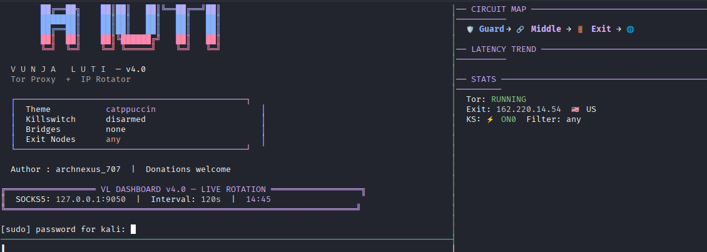

<p align="center">
  
</p>

<h1 align="center">⚡ VUNJA LUTI ⚡</h1>
<h3 align="center">Tor Proxy + IP Rotator v4.0</h3>

<p align="center">
  
  
  
  
</p>

<p align="center">
  
  &nbsp;&nbsp;
  
</p>

---

## 🧠 What Is It?

**Vunja Luti** *(Swahili: "break the web")* is an automated Tor SOCKS5 proxy manager that rotates your IP address at configurable intervals, visualizes Tor circuits, enforces killswitch policies, and proxifies individual applications — all from a beautiful, color-themed terminal interface.

```
   ██╗   ██╗██╗   ██╗███╗   ██╗      ██╗██╗   ██╗████████╗██╗
   ██║   ██║██║   ██║████╗  ██║      ██║██║   ██║╚══██╔══╝██║
   ██║   ██║██║   ██║██╔██╗ ██║      ██║██║   ██║   ██║   ██║
   ╚██╗ ██╔╝██║   ██║██║╚██╗██║      ██║██║   ██║   ██║   ██║
   ╚████╔╝ ╚██████╔╝██║ ╚████║      ██║╚██████╔╝   ██║   ██║
    ╚═══╝   ╚═════╝ ╚═╝  ╚═══╝      ╚═╝ ╚═════╝    ╚═╝   ╚═╝
```

---

## 🚀 Quick Start

```bash
# 1. Clone the repo
git clone https://github.com/archnexus/VUNJA-LUTI.git
cd VUNJA-LUTI

# 2. Install dependencies (first time only)
chmod +x setup.sh && ./setup.sh

# 3. Launch
./Vunja_Luti.sh start

# 4. (Optional) Use the alias after setup
vl start
```

---

## 📸 Screenshot

<p align="center">
  
</p>

---

## 🎮 Commands

| Command | Description |
|---------|-------------|
| `start` | Start Tor + begin rotating IPs |
| `stop` | Stop Tor service |
| `status` | Show exit IP, flag, latency, killswitch |
| `rotate` | Force a single IP rotation now |
| `anoncheck` | Verify Tor is working properly |

---

## ⚙️ Flags

| Flag | Description |
|------|-------------|
| `--theme NAME` | Color theme (see below) |
| `--rotate SECS` | Rotation interval in seconds (default: 60) |
| `--log FILE` | Save rotation history as JSON |
| `--dashboard` | Launch 3-pane tmux dashboard |
| `--exit-filter CC` | Restrict exit nodes: `US`, `DE`, `NL`, `FR`, `JP`... |
| `--fzf-picker` | Interactive exit country selector |
| `--killswitch` | Block all non-Tor traffic (needs `sudo`) |
| `--proxify APP` | Launch app through Tor (`firefox`, `chromium`, `curl`, `nmap`) |
| `--export LOG OUT` | Export rotation log → JSON + CSV |

---

## 🎨 Themes

```bash
./Vunja_Luti.sh --theme <name> start
```

| Theme | Vibe |
|-------|------|
| `catppuccin` | Mauve + lavender pastel *(default)* |
| `tokyo-night` | Deep blue/purple night |
| `nord` | Frost blue, cold & clean |
| `everforest` | Forest green, earthy |
| `rose-pine` | Rose gold + pink |
| `dracula` | Classic purple dark |
| `gruvbox` | Retro warm tones |
| `cyberpunk` | Neon pink + cyan |
| `matrix` | Full green terminal |

---

## 📟 Dashboard

```bash
./Vunja_Luti.sh --dashboard start
```

3-pane tmux layout with live rotation feed, circuit map, latency sparklines, and history log.

---

## 🛡️ Killswitch

```bash
sudo ./Vunja_Luti.sh --killswitch start
```

Blocks all non-Tor traffic via iptables. Prevents accidental IP leaks.

---

## 📂 Requirements

All installed automatically by `setup.sh`:

- `tor`, `curl`, `tmux`, `fzf`, `toilet`, `figlet`
- JetBrainsMono Nerd Font + Emoji font
- Python `requests[socks]`, `rich`
- [tornet](https://github.com/ayadseghairi/tornet) — Tor IP rotation engine

---

## 🧩 Directory Structure

```
VUNJA-LUTI/
├── Vunja_Luti.sh      ← Main script
├── setup.sh            ← One-shot installer
├── README.md
├── assets/             ← Images
└── .gitignore
```

> `tornet/` is auto-cloned by `setup.sh` and git-ignored.

---

## ⚠️ Troubleshooting

| Problem | Fix |
|---------|-----|
| `tornet module not found` | Run `./setup.sh` |
| Tor not running | `sudo systemctl start tor` |
| No exit IP after start | Wait 15s for Tor bootstrap |
| Icons broken | Install Nerd Font via `setup.sh`, restart terminal |
| Killswitch needs root | Run with `sudo` |

---

## 👤 Author

**archnexus_707** — solo developer, privacy advocate, terminal enthusiast.

> 💰 **Donations welcome:** `archnexus_707`

---

## 📜 License

Ethical use only. Authorized testing and privacy protection. Not for illegal activity.

<p align="center">
  <sub>Made with ❤️ on Kali Linux</sub>
</p>
