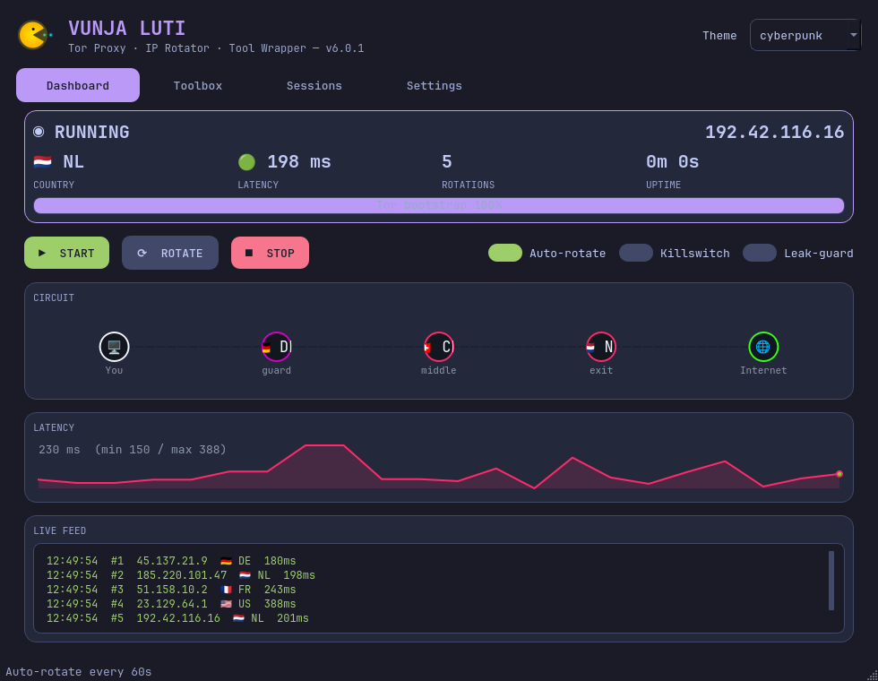
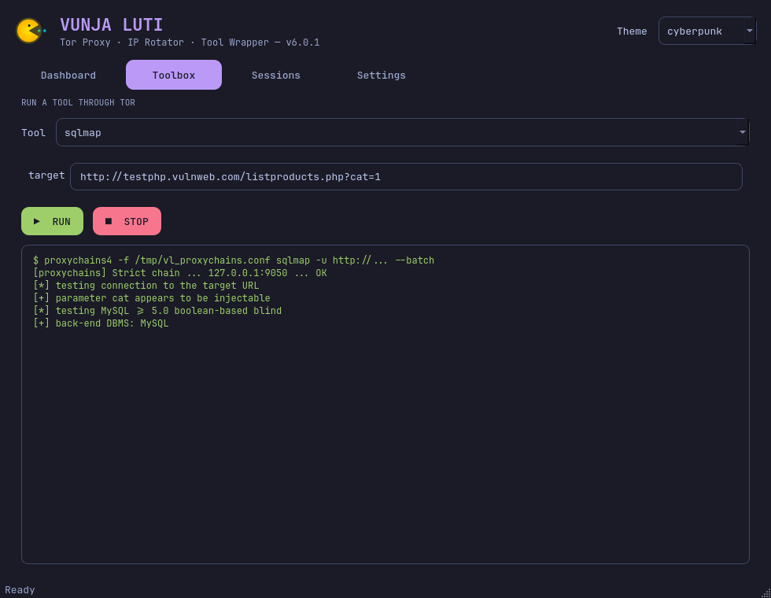
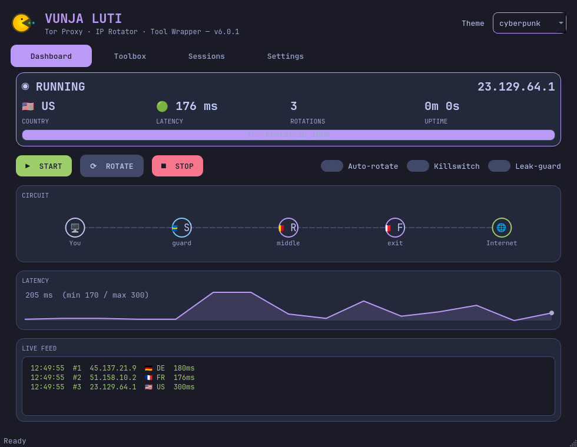
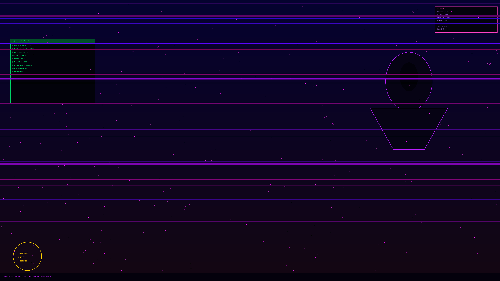
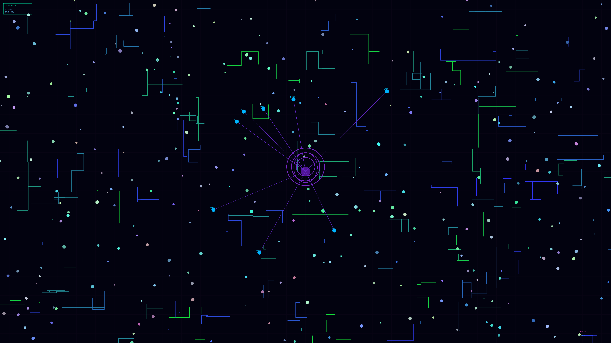

<p align="center">
  
</p>

<h1 align="center">
   &nbsp;VUNJA LUTI <code>v6.1</code>
</h1>

<h3 align="center">Tor Proxy · IP Rotator · Tool Wrapper — neon GUI, themed CLI, two editions (Python &amp; Go)</h3>

<p align="center">
  
  
  
  
  
</p>

---

## 🧠 What is it?

**Vunja Luti** *(Swahili: “break the web”)* routes your traffic through Tor's SOCKS5
proxy, **rotates the exit IP** on a schedule using Tor's control protocol, **wraps any
command** through `proxychains`, and enforces **kill-switch** and **leak-guard** policies.

It ships in **two interoperable editions** — pick whichever you like, they share the
same `~/.config/vl/config.json` and `/etc/tor/torrc`:

- 🐍 **Python edition** — themed CLI + **neon PyQt6** desktop app, installable `.deb`.
- 🐹 **Go edition** — a **single static-binary CLI** (zero deps, `vl status` in ~5 ms) and a
  **Wails** GUI (Go backend + neon web frontend, every Tor call off the UI thread → no lag).

<p align="center">
  
</p>

---

## ✨ Highlights

| | |
|---|---|
| 🖥️ **Desktop GUI** | Live status, animated **circuit map** with country flags, latency sparkline, live rotation feed, system-tray controls + notifications. |
| ⌨️ **Themed CLI** | `vl start / status / rotate / wrap / toolbox / monitor / doctor`, 9 colour themes, truecolour output. |
| 🔁 **Real rotation** | Identity changes via the Tor **control port** (`stem`) — deterministic, not screen-scraping. |
| 🧰 **Tool wrapper** | Push hydra / ffuf / gobuster / sqlmap / nmap / nikto / wpscan / curl through Tor, with auto IP rotation. |
| 🛡️ **Kill-switch** | iptables egress lock with **full backup/restore** — never nukes your existing rules. |
| 🚱 **Leak-guard** | Disables IPv6 + routes DNS through Tor to stop DNS/IPv6 leaks. |
| 🌍 **Exit filter** | Pin exit countries (`us,nl,de`) using **valid** Tor syntax. |
| 🩺 **Doctor** | One command checks the whole stack and auto-enables the Tor control port. |
| 📦 **.deb package** | `apt`-installable, app-menu entry, crisp neon icon, real `vl` / `vunja-luti-gui` commands. |

---

## 🚀 Install

Grab assets from the [**latest release**](https://github.com/archnexus707/VUNJA-LUTI/releases/latest).

### 🐍 Python edition — `.deb` (GUI + CLI)

```bash
sudo apt install ./vunja-luti_6.0.1_all.deb
vl doctor --fix      # enable Tor control port (one time)
vunja-luti-gui       # GUI (or launch "Vunja Luti" from the app menu)
vl start             # CLI rotation loop
```

### 🐹 Go edition — single static binary (CLI)

```bash
wget https://github.com/archnexus707/VUNJA-LUTI/releases/download/v6.1.0/vl-linux-amd64
chmod +x vl-linux-amd64 && sudo mv vl-linux-amd64 /usr/local/bin/vl
vl doctor --fix
vl status            # ~5 ms, zero dependencies
```

### 🐹 Go edition — Wails GUI (build from source)

The Go GUI links webkit, so build it locally (the script installs everything):

```bash
git clone https://github.com/archnexus707/VUNJA-LUTI && cd VUNJA-LUTI/go
./build-gui.sh && ./build/bin/vunja-luti-gui
```

---

## 🖼️ Gallery

<p align="center">
  
  &nbsp;
  
</p>
<p align="center">
  
  &nbsp;&nbsp;
  
</p>

---

## ⌨️ CLI usage

```bash
vl start                       # start Tor + rotate IPs on a loop
vl status                      # exit IP, country flag, latency, circuit
vl rotate                      # force one new identity now
vl anoncheck                   # confirm exit IP ≠ real IP
vl monitor                     # live circuit-health watch + auto-recovery
vl --theme matrix status       # any of 9 themes

# route any tool through Tor (quotes & flags are preserved safely)
vl --rotate 30 wrap -- sqlmap -u 'http://target/page?id=1' --batch
vl wrap -- nmap -sT -Pn -p 80,443 target.com

# security
sudo vl --killswitch start         # block all non-Tor egress (auto-restored on stop)
sudo vl --leak-guard start         # disable IPv6 + DNS-through-Tor
vl --exit-filter us,nl,de status   # pin exit countries
vl reset                           # revert every torrc / firewall change VL made

vl doctor --fix                    # diagnose + auto-enable control port
vl toolbox                         # interactive tool picker
```

---

## 🎨 Themes

`catppuccin` · `tokyo-night` · `nord` · `everforest` · `rose-pine` · `dracula` ·
`gruvbox` · `cyberpunk` *(default)* · `matrix`

Switch live from the GUI header, or `vl --theme <name> …` on the CLI.

---

## 🧩 How rotation works

```
┌──────────┐   ┌──────────────┐   ┌──────────────┐   ┌────────┐
│ Your tool│──▶│ proxychains4 │──▶│  Tor SOCKS5  │──▶│ Target │
│ (sqlmap) │   │ (auto-config)│   │ 127.0.0.1:   │   │        │
└──────────┘   └──────────────┘   │     9050     │   └────────┘
                                  └──────┬───────┘
              NEWNYM via control port ◀──┘  every N seconds
              → fresh exit IP, IDS sees only Tor exits
```

---

## 🛠️ Build from source

```bash
git clone https://github.com/archnexus707/VUNJA-LUTI.git
cd VUNJA-LUTI
```

**Python edition:**
```bash
bash packaging/build-deb.sh                 # build the .deb (uses dpkg-deb)
sudo apt install ./dist/vunja-luti_6.0.1_all.deb
# …or run straight from the tree:
pip install -e . && vl status
```
Deps (pulled in by the `.deb`): `python3-stem`, `python3-requests`, `python3-socks`,
`tor`; recommends `python3-pyqt6`, `proxychains4`, `fonts-noto-color-emoji`.

**Go edition:**
```bash
cd go
CGO_ENABLED=0 go build -ldflags "-s -w" -o vl ./cmd/vl   # static CLI, no deps
./build-gui.sh                                            # Wails GUI (installs webkit + wails)
```

---

## ⚠️ Troubleshooting

| Problem | Fix |
|---|---|
| Rotation does nothing | `vl doctor --fix` — enables Tor's control port |
| GUI won't launch | `sudo apt install python3-pyqt6` |
| `proxychains4 not found` | `sudo apt install proxychains4` |
| Flags show as letters | install `fonts-noto-color-emoji`, restart the app |
| Killswitch locked me out | `vl reset` (restores the iptables snapshot) |
| No exit IP after start | wait ~15 s for Tor to bootstrap |

---

## 🗂️ Project layout

```
vunjaluti/        🐍 Python edition
├── core/         engine·geo·firewall·torrc·wrap·sessions·doctor·config
├── cli/          vl / vunja-luti  (argparse, themed)
├── gui/          PyQt6 app · widgets · workers · neon QSS
└── resources/    icons + fonts
go/               🐹 Go edition
├── internal/core shared engine (Tor control · SOCKS5 · geo · torrc · wrap) — stdlib only
├── cmd/vl        single static-binary CLI
├── app.go main.go + frontend/dist/   Wails neon GUI
└── build-gui.sh  one-command GUI build
packaging/        build-deb.sh · make_icon.py · vunja-luti.desktop
legacy/           the original Vunja_Luti.sh (kept for reference)
```

---

## 👤 Author

**archnexus707** — offensive-security researcher & privacy advocate.
☕ Support: `archnexus707@gmail.com`

## 📜 License

**Ethical use only** — authorised testing and privacy protection. Not for illegal activity.

<p align="center"><sub>Made with ⚡ on Kali Linux by archnexus707</sub></p>
